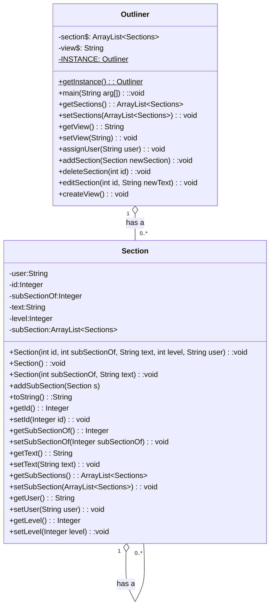

# Title
UML Class Diagram Template
- **Start date**: 01-01-1970  
- **Due date**: 01-01-1970  
- **Main Author:** @ku63026  
- **Collaborators (optional):**  
  - @ku13043, @ku17655  
- **Repository:**
[Outliner in Personal Portfolio]() Add URL 

# 1 Sub-Heading

An example [Mermaid.js](https://mermaid.js.org/) UML Class Diagram template.  This uses Markdown Perhaps some explanatory text about the application could go here with links if required.
[Info about Markdown](https://markdown.land/)  
[Info about Class Diagrams in Mermaid.js](https://mermaid.js.org/syntax/classDiagram.html)  
 

# 2 Sub-Heading
Example Class Diagram

[This was done in the Mermaid Live Editor](https://mermaid.live/)  

[](https://mermaid.live/edit#pako:eNqNVTtv2zAQ_isE4cFq7CBduQVtBwNBMjjtUnVgxbNCQKYCknIaBM5v71F8SKJtJRok6u67797SG61aAZTRquHGfJe81nxfKoLXQ2cbqUCTkn4tKWnXazzdXF9_wZctVFa2ijDyxA3hxFtE6ccGpfIWvdfk6c0L_f04iyFkbTzlgpFbrfnrnTT2Pbgx7wl1kPCCkK3VUtVJurnfPt7ef_vBEu8i6q5qsBtlLFcVLIvFgEiAPZdq6QkJ1_XvPwVjh1aKMUMMZFnMhndlRtAzOLTOmX9hQo51mpEj6jVenNthBWWtfhrQMfAOzycoIYLnZeyXgpdwLKY5CmjAQoRLZYkUGQSEtFPAKkTtaB_hn80DqDRwCzHDQXUcT0KgHAbBpcKyBkvBNspCPbRtbbq_wfRhd6K0GE3O0cABmhkaNtfYPHH3HEeQSuE8e3XvL8l9gybliZwXxLMuMhvX6gRN3TZFAtjWG6OzbNLcfgjXn6wybgRREaT9OJwM73YU3gWKCSSSjdM6Q-tm6fxO9JpJGWZi-tS2DlX73L72S3c2to_WEY3v3EhcKJTXxQr1wxObHLaGrugeNH6uBH7g-30pqX2CPZSU4VHAjneNLWmpHJR32PNXVVFmdQcr2j0LXMbwS6BsxxsDx__HCv9F)
