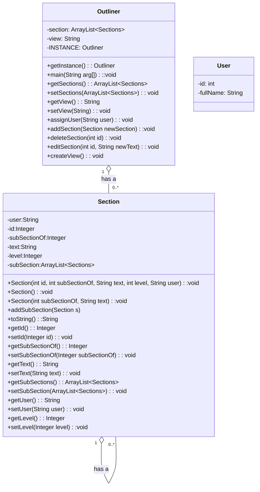

# Title
UML Class Diagram Template
- **Start date**: 01-01-1970  
- **Due date**: 01-01-1970  
- **Main Author:** @ku63026  
- **Collaborators (optional):**  
  - @ku13043, @ku17655  
- **Repository:**
[Outliner in Personal Portfolio]() Add URL 

# 1 Sub-Heading

An example [Mermaid.js](https://mermaid.js.org/) UML Class Diagram template.  This uses Markdown Perhaps some explanatory text about the application could go here with links if required.
[Info about Markdown](https://markdown.land/)  
[Info about Class Diagrams in Mermaid.js](https://mermaid.js.org/syntax/classDiagram.html)  
 

# 2 Sub-Heading
Example Class Diagram

[This was done in the Mermaid Live Editor](https://mermaid.live/)  

